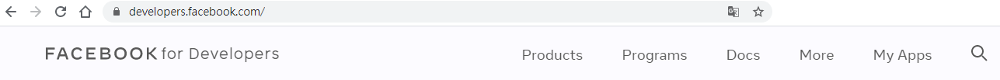

# FB_Messager_Bot

## Step1. Create a Google Apps Script and Deploy it as WebApps  
[Code](./Simple_FB_Chat_Bot.gs)  
   

## Step2. Go to FB and Create a Fans page  
  
    
   
  
## Step3. Go to "FB Developer" and Create a FB APPs  
[FB Developer Website](https://developers.facebook.com/)
  
  
  
  
## Step4. Add FB APPs Product-Messenger and setup  
### 4-1  Add "Messenger"  
  
### 4-2  connect "Page" to "Messenger" product
  
 
### 4-3 Generate a Access Token
  
### 4-4 Add Callback Webhook(The link got from Step1.)
  
  
### 4-5  Subscript a field--"messages"
  
  
## Step5. Finished and Test it
  

